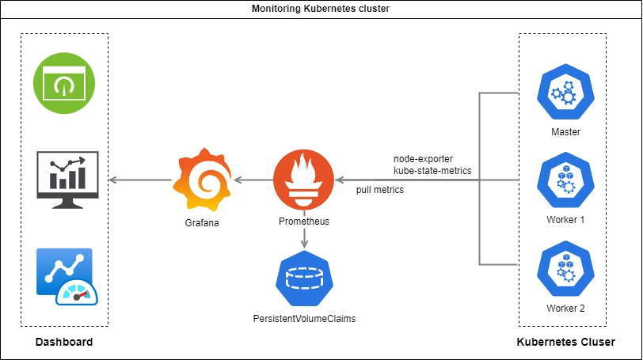

### Storage deployment
- If you are using NFS PVC, first create following folder on NFS server:

```bash
# If you are using NFS PVC, create folder on NFS
sudo mkdir -p /mnt/kubernetes/data/prometheus
sudo mkdir -p /mnt/kubernetes/data/grafana
```
- Then replace nfs server ip in `storage.yaml` files

If you are not using NFS PVC, please update `storage.yaml` by your self.

### Deploy all resources

```bash
kubectl create namespace monitoring
kubectl apply -f prometheus/
kubectl apply -f kube-state-metrics/
kubectl apply -f node-exporter/
kubectl apply -f grafana/
```
